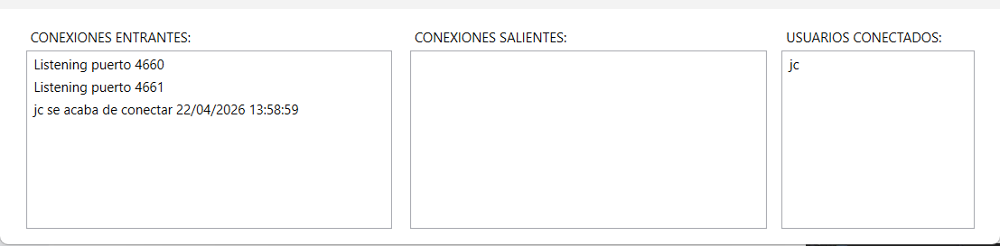
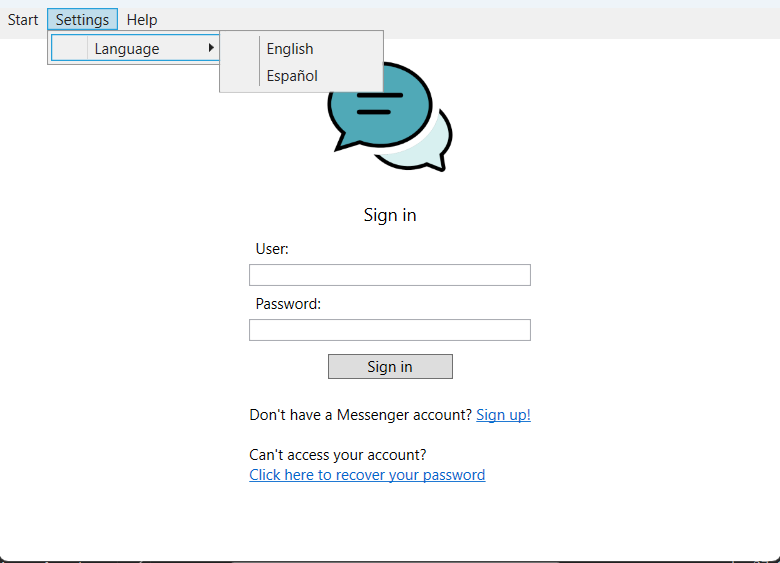

# Messenger (2014 Legacy)

A messaging app originally built with .NET Framework 4.0 and WPF. This project served as the architectural foundation for a production-level messaging platform and I am keeping it here for technical reference.

### Under the hood
* **TCP Sockets**: I used `TcpListener` to build a multi-threaded server from scratch, using my own binary protocol to manage the communication between users.
* **Audio**: Real-time voice capture and playback using `DirectSound`.
* **Data Layer**: Decoupled persistence library for MySQL using raw ADO.NET, focused on connection lifecycles and secure parameterized queries.
* **UI**: WPF client with XAML and multi-language support.

| Server Dashboard | Client |
| :---: | :---: |
|  |  |